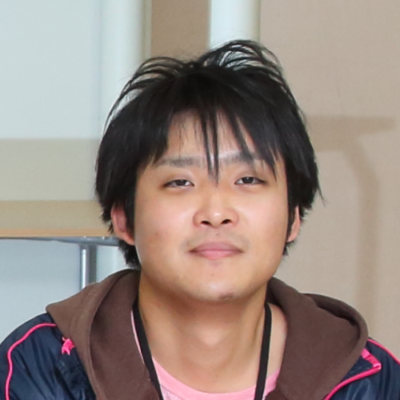

# プロフィール
## 名前
依田　拓也

## 所属
* 大阪大学大学院 情報科学研究科 コンピュータサイエンス専攻 知能メディア複合講座

## 学年
* 博士後期 1年

## 学歴
* 2018年4月	大阪大学大学院 情報科学研究科 コンピュータサイエンス専攻 博士後期課程 入学
* 2018年3月	九州大学大学院 システム情報科学府 情報知能工学専攻 修士課程 卒業
* 2017年4月〜2018年3月 大阪大学 産業科学研究科 特別研究学生
* 2016年4月	九州大学大学院 システム情報科学府 情報知能工学専攻 修士課程 入学
* 2016年3月	九州大学 工学部 電気情報工学科 卒業
* 2012年4月	九州大学 工学部 電気情報工学科 入学
* 2012年3月	広島県立尾道北高等学校 卒業

---
# 連絡先
## E-Mail
yoda@am.sanken.osaka-u.ac.jp

## 電話番号/FAX
* TEL : 06-6105-6074 
* FAX : 06-6105-6075

## 住所
〒565-0871

大阪府吹田市山田丘2番8号テクノアライアンス棟 4階 データビリティフロンティア機構

---
# 研究
*Coming soon...*

---
# 発表文献
## 論文誌
* Takuya Yoda, Hajime Nagahara, Rin-ichiro Taniguchi, Keiichiro Kagawa, Keita Yasutomi, Shoji Kawahito, "The Dynamic Photometric Stereo Method using Multi-tap CMOS Image Sensor", Sensors, vol. 18, number 3, Mar., 2018 <a href="http://www.mdpi.com/1424-8220/18/3/786" target="_blank">[paper]</a> <a href="biblio/bibtex0008.bib">[bibtex]</a>

## 国際会議
* [Poster] Takuya Yoda, Hajime Nagahara, Rin-ichiro Taniguchi, Keiichiro Kagawa, Keita Yasutomi, Shoji Kawahito, "Dynamic Photometric Stereo Method using Multi-tap CMOS Image Sensor",
The 13th Joint Workshop on Machine Perception and Robotics (MPR2017), Oct., 2017 <a href="biblio/bibtex0006.bib">[bibtex]</a>
* [Oral] Takuya Yoda, Hajime Nagahara, Rin-ichiro Taniguchi, Keiichiro Kagawa, Keita Yasutomi, Shoji Kawahito, "Dynamic Photometric Stereo Method using Multi-tap CMOS Image Sensor", International Conference on Pattern Recognition (ICPR2016), pp.2357-2362, Mexico, Dec., 2016 (Acceptance Rate:16.7%, orals) <a href="http://ieeexplore.ieee.org/document/7899988/" target="_blank">[paper]</a> <a href="biblio/bibtex0004.bib">[bibtex]</a>
* [Poster] Takuya Yoda, Hajime Nagahara, Rin-ichiro Taniguchi, Keiichiro Kagawa, Keita Yasutomi, Shoji Kawahito, "Dynamic Photometric Stereo Method using Multi-tap CMOS Image Sensor", 3rd International Workshop on Image Sensors and Imaging Systems(IWISS2016), pp1-2, Nov., 2016 <a href="http://www.ite.or.jp/ken/paper/20161117uA59/eng/" target="_blank">[detail]</a> <a href="biblio/bibtex0003.bib">[bibtex]</a>

## 国内会議
* [Demonstration] 依田 拓也, 長原 一, 谷口 倫一郎, 香川 景一郎, 安富 啓太, 川人 祥二, “マルチタップCMOSイメージセンサを用いたダイナミック照度差ステレオ法”, 第11回新画像システム・情報フォトニクス研究討論会, 東京, 11月, 2017 <a href="biblio/bibtex0007.bib">[bibtex]</a>
* [Demonstration] 依田 拓也, 長原 一, 谷口 倫一郎, 香川 景一郎, 安富 啓太, 川人 祥二, “マルチタップCMOSイメージセンサを用いたダイナミック照度差ステレオ法”, 第20回画像の認識・理解シンポジウム（MIRU2017), 広島, 8月, 2017 <a href="biblio/bibtex0005.bib">[bibtex]</a>
* [Poster] 依田 拓也, 長原 一, 谷口 倫一郎, 香川 景一郎, 安富 啓太, 川人 祥二, “マルチタップCMOSイメージセンサを用いたダイナミック照度差ステレオ法”, 第19回画像の認識・理解シンポジウム（MIRU2016), 静岡, 8月, 2016 <a href="biblio/bibtex0002.bib">[bibtex]</a>
* [Poster] 依田 拓也, 長原 一, 谷口 倫一郎, 香川 景一郎, 安富 啓太, 川人 祥二, “マルチタップCMOSイメージセンサを用いたダイナミック照度差ステレオ法”, 情報処理学会コンピュータビジョンとイメージメディア研究会(2016-CVIM-202), pp.1-8, 大阪, 5月, 2016 <a href="https://ipsj.ixsq.nii.ac.jp/ej/index.php?active_action=repository_view_main_item_detail&page_id=13&block_id=8&item_id=159158&item_no=1" target="_blank">[detail]</a> <a href="biblio/bibtex0001.bib">[bibtex]</a>

---
# 受賞歴
* <a href="http://portal.isee.kyushu-u.ac.jp/alumni/topics/H29award" target="_blank">第8回(平成29年度)九州大学大学院システム情報科学府 優秀学生表彰 受賞</a>
* <a href="award/MPR2017_youngResearcherGroupWorkAward.pdf" target="_blank">Honorable Mention Young Researcher Group Work Award at the 13th Joint Workshop on Machine Perception and Robotics</a> (presentation title is *"An Automatic Bike Sharing Relocation System"*)
* <a href="http://cvim.ipsj.or.jp/MIRU2017/index.php?id=awards" target="_blank">第20回画像の認識・理解シンポジウム (MIRU2017) 学生奨励賞</a> (対象論文 “マルチタップCMOSイメージセンサを用いたダイナミック照度差ステレオ法”)
