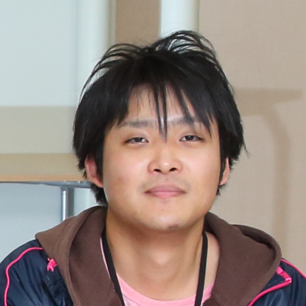

# Profile
## Name
Takuya Yoda

## Organization Name
* Department of Advanced Information Technology, Graduate School of Information Science and Electrical Engineering, Kyushu University

## Course
* Master Course (Second year)

---
# Contact
## E-Mail
yoda@limu.ait.kyushu-u.ac.jp

## TEL
* TEL : +81-6-6105-6074

## Address
Institute for Datability Science, Osaka University

2-8 Yamadaoka, Suita, Osaka 565-0871, Japan

---
# Research
*Coming soon...*

---
# Publication
## Journal
* Takuya Yoda, Hajime Nagahara, Rin-ichiro Taniguchi, Keiichiro Kagawa, Keita Yasutomi, Shoji Kawahito, "The Dynamic Photometric Stereo Method using Multi-tap CMOS Image Sensor", Sensors, vol. 18, number 3, Mar., 2018 <a href="http://www.mdpi.com/1424-8220/18/3/786" target="_blank">[paper]</a> <a href="biblio/bibtex0008.bib">[bibtex]</a>

## International Conferences
* [Poster] Takuya Yoda, Hajime Nagahara, Rin-ichiro Taniguchi, Keiichiro Kagawa, Keita Yasutomi, Shoji Kawahito, "Dynamic Photometric Stereo Method using Multi-tap CMOS Image Sensor",
The 13th Joint Workshop on Machine Perception and Robotics (MPR2017), Oct., 2017 <a href="biblio/bibtex0006.bib">[bibtex]</a>
* [Oral] Takuya Yoda, Hajime Nagahara, Rin-ichiro Taniguchi, Keiichiro Kagawa, Keita Yasutomi, Shoji Kawahito, "Dynamic Photometric Stereo Method using Multi-tap CMOS Image Sensor", International Conference on Pattern Recognition (ICPR2016), pp.2357-2362, Mexico, Dec., 2016 (Acceptance Rate:16.7%, orals) <a href="http://ieeexplore.ieee.org/document/7899988/" target="_blank">[paper]</a> <a href="biblio/bibtex0004.bib">[bibtex]</a>
* [Poster] Takuya Yoda, Hajime Nagahara, Rin-ichiro Taniguchi, Keiichiro Kagawa, Keita Yasutomi, Shoji Kawahito, "Dynamic Photometric Stereo Method using Multi-tap CMOS Image Sensor", 3rd International Workshop on Image Sensors and Imaging Systems(IWISS2016), pp1-2, Nov., 2016 <a href="http://www.ite.or.jp/ken/paper/20161117uA59/eng/" target="_blank">[detail]</a> <a href="biblio/bibtex0003.bib">[bibtex]</a>

---
# Award
* <a href="award/MPR2017_youngResearcherGroupWorkAward.pdf" target="_blank">Honorable Mention Young Researcher Group Work Award at the 13th Joint Workshop on Machine Perception and Robotics</a> (presentation title is *"An Automatic Bike Sharing Relocation System"*)
